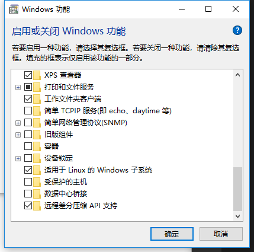
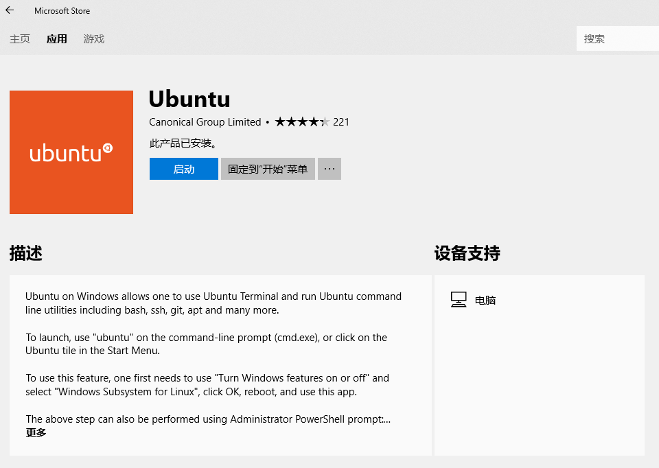
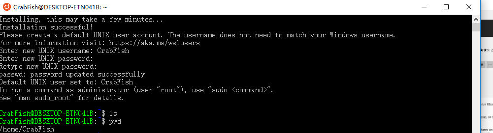
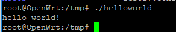

# Windows下WRTnode交叉编译环境配置指北

## 要求

在Windows上安装配置可以交叉编译在WRTNode上运行的程序的C语言编译器

## 安装Windows下的Linux子系统

在经过长时间资料查找、试验后，直接基于Windows环境下进行配置相对而言不太现实。

在Openwrt官方wiki的cross compile页面下下有以下说明：

>If you want to use a program, currently not contained in the OpenWrt repository, you probably won't find a binary compiled for your CPU. Provided that it is released as open source, you can download the code and compile it using the OpenWrt Buildroot.

而后的Procedure中有如下说明：

>Follow the build instructions outlined in OpenWrt Buildroot – Usage

在给出的链接中可以看到如下指示：

>OpenWrt build system is the buildsystem for the OpenWrt Linux distribution. OpenWrt build system works on GNU/Linux, BSD or MacOSX operating system. A case-sensitive filesystem is required.

>It is recommended that you use a GNU/Linux distribution (Debian), either a standalone installation or one running in a virtual environment (VMware or Qemu).

>Ubuntu under Windows Subsystem for Linux is not an officially supported environment, but it appears to produce good builds. Cygwin(Windows) will not be supported because of the lack of case sensitivity in the file system.

这里感谢助教告诉我可以使用Windows下的Linux子系统。我们可以在设置中打开开发人员模式。


然后可以在控制面板->Windows功能中打开子系统。


最后在应用商店或cmd中安装。


安装完成后的界面：


## 配置交叉编译环境

在子系统中，我们可以正式开始配置交叉编译的环境。

首先从openwrt的官网中下载编译工具链：
```
wget https://downloads.openwrt.org/barrier_breaker/14.07/ramips/mt7620n/OpenWrt-Toolchain-ramips-for-mipsel_24kec%2bdsp-gcc-4.8-linaro_uClibc-0.9.33.2.tar.bz2
```
然后进行解压：
```
tar -xjf OpenWrt-Toolchain-ramips-for-mipsel_24kec+dsp-gcc-4.8-linaro_uClibc-0.9.33.2.tar.bz2
```
将编译工具添加到环境变量中去：
```
 export PATH=$PATH:/home/CrabFish/OpenWrt-Toolchain-ramips-for-mipsel_24kec+dsp-gcc-4.8-linaro_uClibc-0.9.33.2/toolchain-mipsel_24kec+dsp_gcc-4.8-linaro_uClibc-0.9.33.2/bin
 ```
 然后以helloworld为例，编写完成后输入指令编译：
 ```
 mipsel-openwrt-linux-gcc helloworld.c -o helloworld
 ```
 把生成的helloworld文件通过scp传输到开发板中:
 ```
 scp ./helloworld root@192.168.8.1:/tmp
 ```
 最后在我们的开发板中进行验证：
 

 最后感慨下，openwrt在windows上做开发真的是很复杂啊，还是直接在linux上会方便很多。
