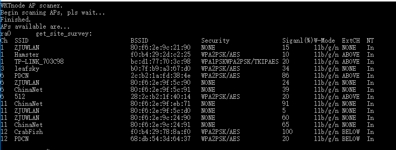
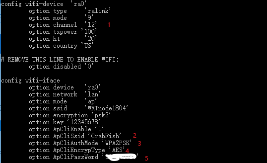
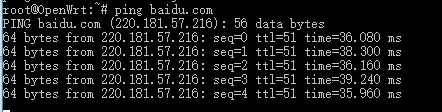
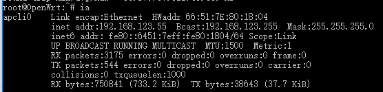

# WRTNode开机配置指北
## 找到WRTnode开发板
开发板位于贴有"ZJUCE ES Lab"的标签的盒子中。是一块正方形的正面呈黄色，背面有泡沫的小板子。如图所示：


在盒子中还有一根专用的定制USB线,此USB线在提供5v供电同时提供了一个USB母座，可以用来连接USB设备。

## 将WRTnode连接到电脑

用USB线连接WRTnode的microUSB接口，然后把USB线插到一个超过500ma对的5v供电的地方，比如说电脑，然后板子上的一盏蓝灯会开始闪烁，然后当开机完成后蓝灯常量，如图：


此时，在电脑或手机搜索wifi处能够发现以WRTnode开头的wifi，连接即可，初始密码为12345678。


连接后在命令行中输入
```
ping 192.168.8.1
```
如果ping的通的话就表明已经连接成功，其中192.168.8.1也可以换成i.wrtno.de或wrtnode.lan或openwrt.lan。这几个域名都会被解析得到192.168.8.1。

然后我们可以通过telnet登录到WRTnode，这里我没有给OpenWrt的root用户设置密码，如果设置了密码telnet就会被屏蔽，只能用ssh登录。密码可以通过telnet登录后进行设置，也可以在网页中输入192.168.8.1后在luci中设置。
输入
```
telnet 192.168.8.1
```
会出现如下界面：

即表明登陆成功。

## 将WRTnode连接到网络
登陆到WRTnode后我们就可以通过无限或者有线连接的方式直接连接到网络了。

有线连接非常快捷方便，因为上级路由器采用的是DHCP服务，所以也不需要额外的设置。在盒子里也有提供特制的网线，所以可以直接连接，不用特意裁剪了。连接的图示如下所示：


如果没有网线，也可以通过无线的方式连接热点。

首先用命令搜索附近wifi
```
aps
```
在短暂延迟后会出现附近的wifi热点。如图

其中CrabFish是我的wifi。这里要注意的是在开始的时候我一直无法在热点列表中找到我的wifi，直到后来在路由器的设置界面中将无线模式由g/n mixed修改为b/g/n mixed才能搜索到。

然后修改/etc/config/wireless配置文件。

1处修改为上图中要连的wifi的ch项，后面的根据实际路由器配置情况进行修改。

然后输入命令重启无线网络
```
nr
```
之后就可以发现已经能够连接到网络了。




重启后也会自动连接上wifi。
